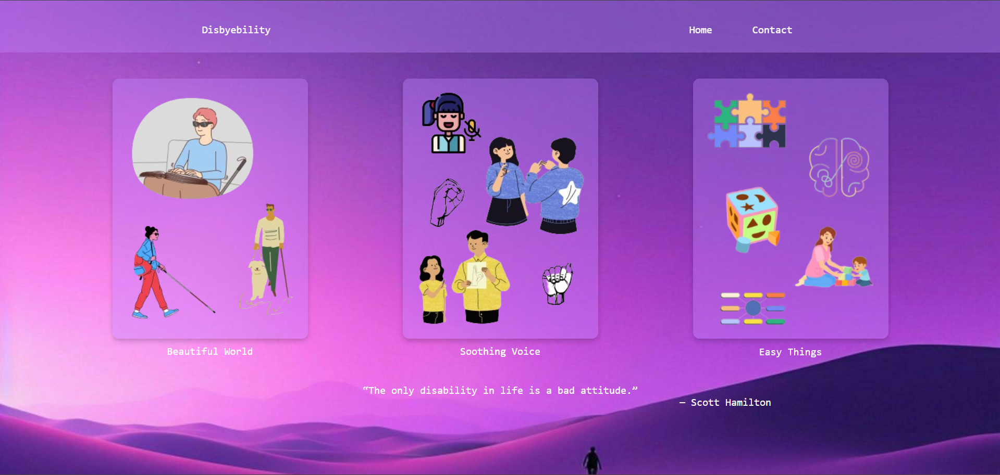
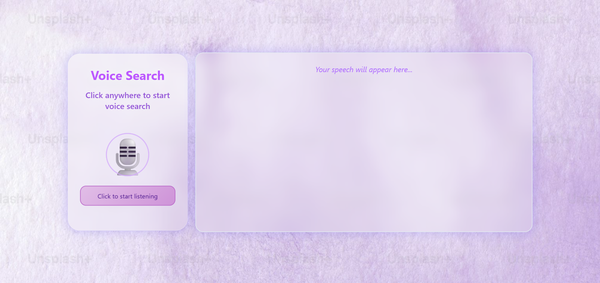

# 🧠 Disbyebility

**Disbyebility** is an inclusive web application designed to make technology accessible to **everyone**, including individuals with **visual, hearing, and cognitive disabilities**. It combines adaptive communication interfaces and accessibility best practices to ensure no one is left behind in the digital world.

## 🌍 Why Disbyebility?

Over **1 billion people** globally live with some form of disability. Disbyebility ensures that essential digital interactions remain accessible by supporting:

- 🗣️ **Voice input and output** for the **visually impaired**
- ✍️ **Text-based chat** for **mute or hearing-impaired** users
- 🧠 **Simplified language responses** for users with **cognitive disabilities**

Built with **WCAG (Web Content Accessibility Guidelines)** in mind, the website is intuitive, responsive, and designed for ease of navigation.

---

## 🚀 Features

- 🎤 **Voice Chatbot**: Allows blind users to speak to and hear responses from the chatbot.
- 💬 **Text Chatbot**: A standard chat interface for users who cannot speak or hear.
- 🔄 **Easy Language Mode**: Translates complex answers into simple, understandable language.
- 🎨 **Accessible UI**: High contrast, large text, keyboard navigable, and screen-reader friendly.

---

## 🧰 Tech Stack

- **Frontend**: HTML, CSS, JavaScript
- **Backend**: Python
- **APIs**: Google Speech-to-Text, Text-to-Speech, OpenAI/GPT-3.5-turbo for chatbot responses
- **Accessibility**: ARIA roles, semantic HTML, WCAG 2.1 compliance

---






## 📦 Installation

1. **Clone the repository**

   ```bash
   git clone https://github.com/Lavanya24R/Disbyebility.git
   cd Disbyebility

2. **Create a python environment**

   ```bash
   python -m venv .venv

3. **Activate the environment**

   ```bash
   Windows: .\venv\Scripts\activate
   Mac/Linux: source venv/bin/activate


4. **Install the required libraries**

   ```bash
   pip install flask flask_cors requests os dotenv

5. **Create API Key**

   Go to: https://openrouter.ai/settings/keys
   Create an API Key and paste it in a .env file in the ./(root) directory
   .env file:
   OPENROUTER_API_KEY=XXXXXXXXXXXXXXXXXXXXX

6. **Run python scripts**

   ```bash
   python app.py

7. **Open the html files**

   Open the index.html file in the browser using live server
